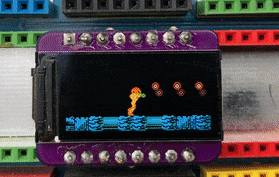

# Metroid Mini Badge!

## Bill of Materials 
* 0.96" 80x160 ST7735 TFT LCD Display
* STMS001J3
* 0804 22 Ohm Resistor
* Pin headers

The 8K of flash isn't enough space to hold 65536 color sprites for the full animation. since the NES only used 16 colors I'm storing 2 pixels per byte (4 bits each).  The convert.py script does this for me.
