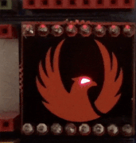

# Phoenix mini badge

This badge had a CTF associated with it. The badge face is touch sensitive and would display a URL on the main badge when touched. There were some issues with the 2019 SAINTCON badge and the link would display in like 1:100 touches.

The eye slowly pulses normally and blinks rapidly when touched
