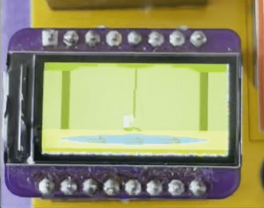

# Pitfall Mini Badge!

## Bill of Materials 
* 0.96" 80x160 ST7735 TFT LCD Display
* STMS001J3
* 22 Ohm 0603 Resistor
* 1uF 0603 Capacitor
* Pin headers

Same hardware as the Metroid Mini Badge

The sketch is a tribute to the original Atari Pitfall! programers who wrote the whole game in 4K. (This minibaddge take more than that just for this short animation)
