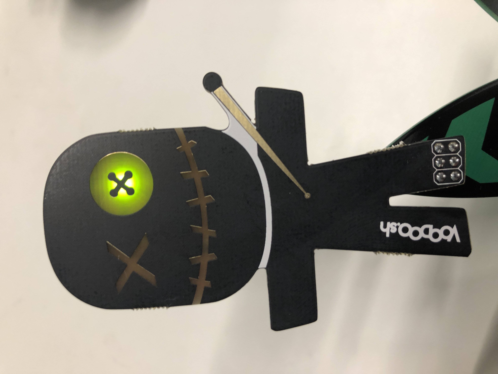

#Voodoo Doll SOA

This isn't a mini badge per say but it’s very similar and based off the same chip so I’m including it. I can’t seem to locate the Eagle files for this project but once I do I’ll add them to the repo.

##Bill of Materials
* STMS001J3
* LSG T77K-JL Red/Green LED
* 2x 1M Ohm 0603 LED
* Cr2032 battery holder (optional)
* 2x3 pin header (optional if using battery)
